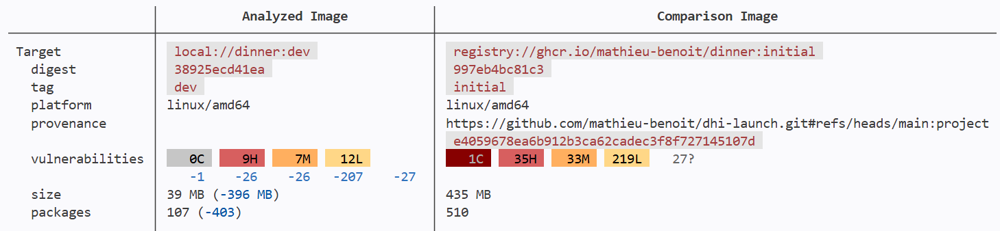

# Use DHI

In this section you will replace the public Python image used in the `FROM` instruction of the `Dockerfile` by the DHI Python `-dev` variant. And see already great benefits with it!

## Update the Dockerfile to use an hardened `dev` base image

Change the base image in the `FROM` instruction in the :fileLink[Dockerfile]{path="Dockerfile" line=1} and save.

```yaml
FROM $$registry$$python:3.14-debian13-dev
```

```diff no-copy-button
- FROM python:3.14
+ FROM $$registry$$python:3.14-debian13-dev
```

Build the updated image with the hardened `dev` variant:

```bash
docker build -t dinner:dev .
```

Compare the CVEs between the initial image and the latest hardened `dev` image built locally:

```bash
docker scout compare \
    --ignore-unchanged \
    --to $$ghcr$$/mathieu-benoit/dinner:initial \
    dinner:dev
```



See the number of CVEs, packages and size of the image just got improved:
- CVEs: -491
- Packages: -311
- Size (on disk): -373MB
- Run-as: `root`

## Test the "shell" variant

Try to run a shell with this hardened `dev` image built locally:

```bash
docker run --rm -it dinner:dev sh
```

You can run some commands because this `dev` variant image has a shell, a package manager and extra system packages.

```bash
whomai
cat /etc/os-release
pip --version
apt --version
```

Exit the opened shell:

```bash
exit
```