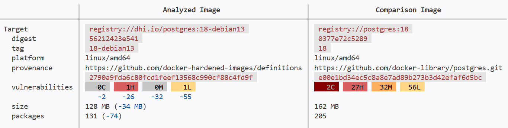

# Docker Compose

In this section you will see how you use a DHI PostgreSQL image in your Docker Compose file.

## Modify the Docker Compose file to use the PostgreSQL image

Change the db image in the :fileLink[compose.yaml]{path="compose.yaml" line=12} and save.

```yaml
image: $$registry$$postgres:18-debian13
```

```diff no-copy-button
- image: postgres:18
+ image: $$registry$$postgres:18-debian13
```

## Run the application

Run the application:
```bash
docker compose up -d --build
```

Check that the containers are running successfully:
```bash
docker ps
```

Go to the application in the browser: :tabLink[http://localhost:5001]{href="http://localhost:5001" title="App" id=app}.

Enter a reservation using the application to confirm that the application is working.

## Scan the PostgreSQL image

Compare the CVEs between the initial PostgreSQL image and the hardened PostgreSQL image:

```bash
docker scout compare \
    --ignore-unchanged \
    --to registry://$$dockerhub$$/postgres:18 \
    registry://$$registry$$postgres:18-debian13
```



✅ See the number of CVEs, packages and size of the image just got improved:
- CVEs: -115
- Packages: -74
- Size (on disk): 82 MB
- Run-as: `root` --> `postgres`