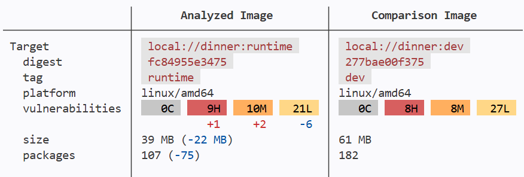

# Multi-stage build

In this section you will optimize the final base image by using the runtime (i.e. `distroless`) variant of the DHI Python image. And see even more benefits with it to safely run in Production!

## Update the Dockerfile to use a runtime base image

Update the :fileLink[Dockerfile]{path="Dockerfile"} with this content:

```yaml save-as=Dockerfile
FROM $$registry$$python:3.14-debian13-dev AS builder
ENV PYTHONDONTWRITEBYTECODE=1
ENV PYTHONUNBUFFERED=1
WORKDIR /app
COPY requirements.txt .
RUN pip install --no-cache-dir -r requirements.txt --target /app

FROM $$registry$$python:3.14-debian13 AS runtime
ENV PYTHONDONTWRITEBYTECODE=1
ENV PYTHONUNBUFFERED=1
COPY --from=builder /app /app
COPY . /app
EXPOSE 5000
CMD ["python", "/app/app.py"]
```

```bash
docker build -t dinner:runtime .
```

Compare the CVEs between the `dev` and the `runtime` hardened images built locally:

```bash
docker scout compare \
    --ignore-unchanged \
    --to dinner:dev \
    dinner:runtime
```



See the number of CVEs, packages and size of the image just got improved:
- CVEs: -16
- Packages: -75
- Size (on disk): -1.42GB
- Run-as: `root` --> `nonroot`

## Test the "no shell" variant

Try to run a shell with this hardened `runtime` image built locally:

```bash
docker run --rm -it dinner:runtime sh
```

You get this error message:

```none no-copy-button
OCI runtime create failed: runc create failed: unable to start container process: error during container init: exec: "sh": executable file not found in $PATH
```

You cannot run any commands because this `runtime` variant image doesn't have a shell, a package manager or any extra system packages.

_Note: Out of scope of this workshop, but instead, you can use the `docker debug` or `kubectl debug` commands to attach a temporary, tool-rich debug container to the running instance._
